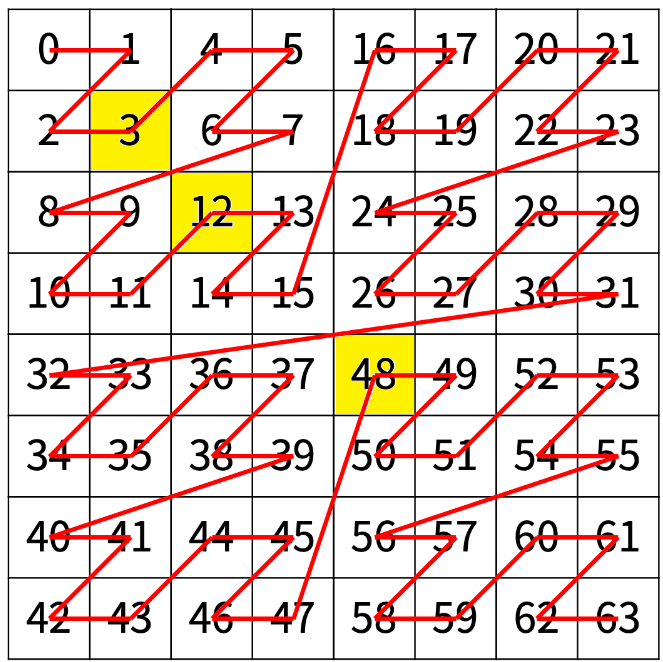
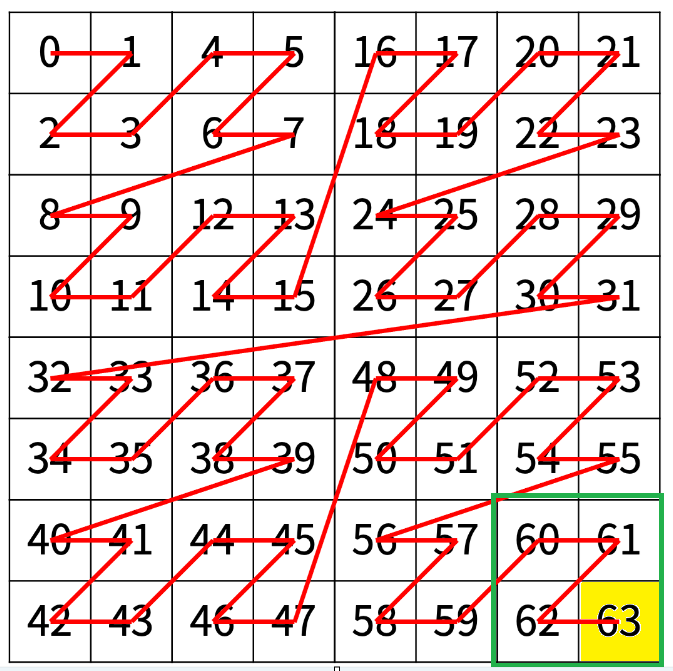
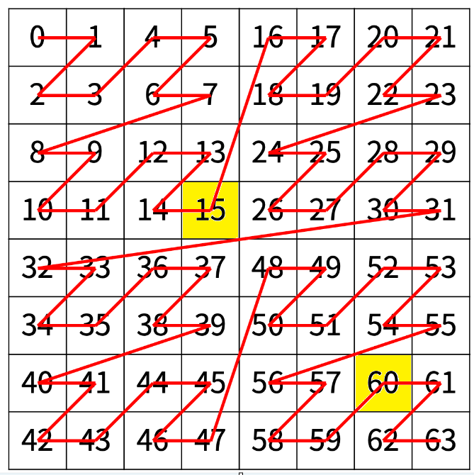
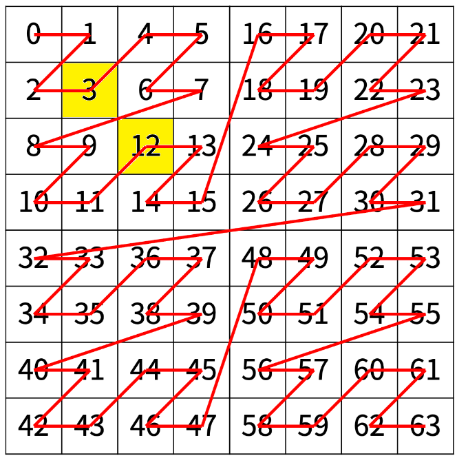

# 재귀 풀이

### 1단계 규칙 찾기

(r, c) => (2r, 2c)

값 => 2\*값

---

### 4칸 중 어떤 행, 열에 있는지 찾아내기

60이라는 값으로 부터 +3 되어있다!

## 2\*(r%2)+(c%2)

### 60이라는 값을 다르게 표현하면?

15의 4배가 된 값!

그렇다면 15는?

12 + 3!

---

### 여기서 다시 12는 4 \* 3!

