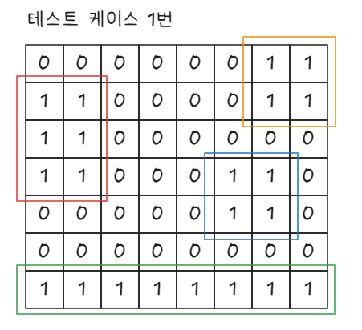
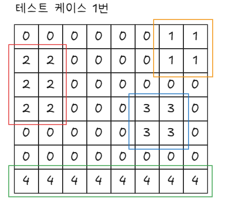
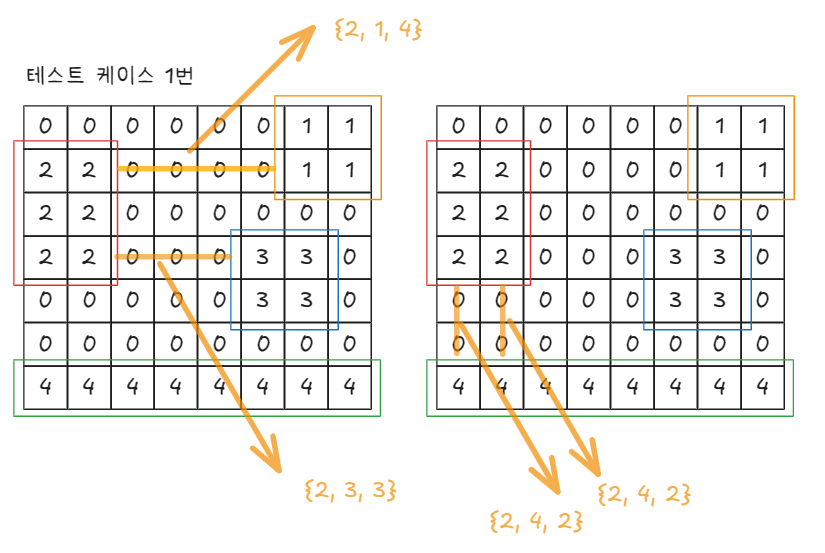
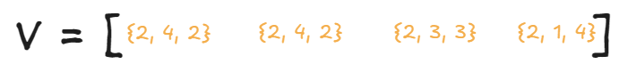
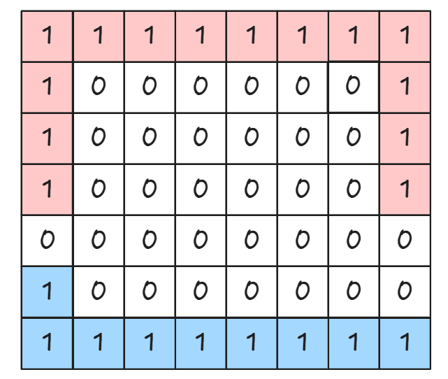
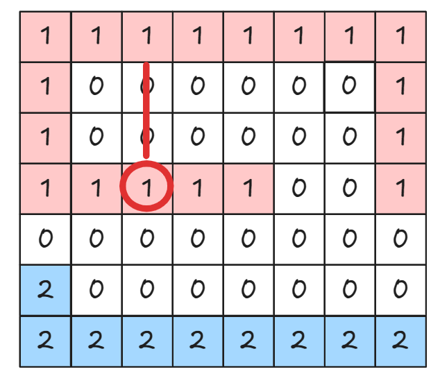

`백준 다리 만들기2(17472)`

# 아이디어
MST(최소 신장 트리)를 만들어야 하는 문제이다.

즉, `union-find`를 이용한 `Kruskal` 문제이다.

Kruskal 알고리즘의 원리는 다음과 같다.

1. Edge를 cost기준 오름차순 정렬한다.

2. 이미 같은 집합이라면 넘어가고, 다른 집합이라면 묶는다.

3. 연결한 Edge 개수 = (Node의 개수 - 1) 일 때, MST가 완성되므로 Break!

현재 문제는 Kruskal의 알고리즘을 적용하기 위한 초기 세팅이 되어있지 않다.

Kruskal은 단순 암기로, 이 문제의 핵심은 `초기 세팅을 만들어주는 과정`이다.

## 초기 입력 상태


초기 입력 상태는 다음과 같다.

이 상태에서는 섬의 종류를 구분할 수 없다.

왜냐햐면 숫자들이 전부다 1로 주어져있기 때문이다.

## BFS로 섬의 종류 구분


BFS를 이용하여 다음과 같이 섬의 종류를 구분해준다.

## 다리 구하기
구현하는 방법은 많다.

나의 경우는 가로, 세로에 대해서 2중 For문을 사용하여 가능한 다리를 모두 계산했다. (1은 제외)


해당 다리를 모두 Vector에 넣는다.

## cost 기준 오름차순 정렬
Kruskal을 위한 모든 준비가 다 되었다.

이제, 다리 정보를 넣은 Vector를 cost 기준 오름차순 정렬한다.


## Kruskal
Kruskal 실행, 답 도출!

# 함정
이 문제는 골드1 이다.

확실히 생각보다 고려할 사항도 많았고 그만큼 함정도 많고 복잡했다.

내가 겪은 문제는 다음과 같이 3가지이다.
## BFS out_of_index 조건 생략
```cpp
//배열의 범위를 벗어난다면
if (next.y < 0 || next.x < 0 || next.y >= N || next.x >= M)
    continue;
```

해당 조건을 생략하여 다음과 같은 테스트 케이스에서 무한 로딩이 걸렸다.


## Kruskal() 함수의 반환값은 void
```cpp
void kruskal()
{
    int a;
    int b;
    int cost;
    int selectCnt = 0;

    for (Bridge bridge : bridges)
    {
        a = bridge.a;
        b = bridge.b;
        cost = bridge.cost;

        if (find(a) == find(b))
            continue;

        setUnion(a, b);
        selectCnt++;
        ans += cost;

        if (selectCnt == assign - 2)
            break;
    }
}
```

원래는 이렇게 작성했다.

이렇게 했을 때 문제점은, 애시당초 모든 섬을 연결하지 못하는 테스트 케이스(답:-1)의 경우에 오류가 났었다.

즉, `selectCnt == assign - 2`의 조건을 만나지 못하고 for문이 종료되어 ans에 애매한 값이 저장되었다.

```cpp
int kruskal()
{
    int a;
    int b;
    int cost;
    int selectCnt = 0;
    int result = 0;

    for (Bridge bridge : bridges)
    {
        a = bridge.a;
        b = bridge.b;
        cost = bridge.cost;

        if (find(a) == find(b))
            continue;

        setUnion(a, b);
        selectCnt++;
        result += cost;

        if (selectCnt == assign - 2)
            return result;
    }
    return -1;
}
```

차라리 이런식으로 반환값을 주는게 오류가 날 확률이 적다.

## 다리를 구하는 과정에서 예외 케이스


다음과 같은 경우에서는 다리의 길이를 0으로 초기화하고 다시 카운트를 해야하는데, 그러지 못했다.

구현하는 방법에 따라, 다르겠지만 이런 예외 케이스또한 처리될 수 있는 견고한 구현 방법이 필요함을 느꼈다.

