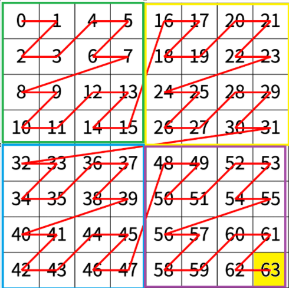
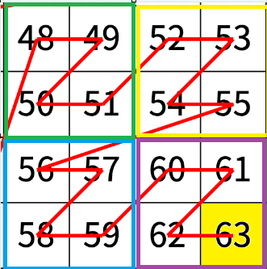
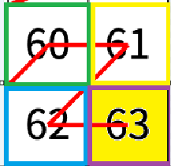

# 분할정복 풀이

### 1단계 (N = 3)

좌표 `(7,7)`은 `N = 3` 크기 배열에서 **제4사분면**에 속한다.

- `r = 7 ≥ 2^2`, `c = 7 ≥ 2^2` → 제4사분면
- 제4사분면은 `48`부터 시작한다.
- 각 사분면 크기: `2^2 × 2^2 = 16`
  - 제2사분면 시작: 0
  - 제1사분면 시작: 16
  - 제3사분면 시작: 32
  - 제4사분면 시작: 48

---

### 2단계 (N = 2)

이제 좌표는 `(7-4, 7-4) = (3,3)`이 된다.

- `(3,3)` 역시 `N = 2` 배열에서 **제4사분면**
- 제4사분면은 `12`부터 시작한다.
- 각 사분면 크기: `2^1 × 2^1 = 4`
  - 제2사분면 시작: 0
  - 제1사분면 시작: 4
  - 제3사분면 시작: 8
  - 제4사분면 시작: 12

즉, 지금까지의 누적값은  
`48 + 12`

---

### 3단계 (N = 1)

좌표 `(3,3)` → `(1,1)`

- `(1,1)`은 `N = 1` 배열에서 **제4사분면**
- 제4사분면은 `3`부터 시작한다.
- 각 사분면 크기: `2^0 × 2^0 = 1`
  - 제2사분면 시작: 0
  - 제1사분면 시작: 1
  - 제3사분면 시작: 2
  - 제4사분면 시작: 3

즉, 누적값은  
`48 + 12 + 3 = 63`

---

## 최종 결과

따라서 `(7,7)` 좌표의 값은 **63**이 된다.
