# 1. 문제 상황 이해


"순서대로" 일어난다

1번째 단계에 대해서 착각하기 쉽다.

## 1-1-0. 초기상태


## 1-1-1. 벨트 이동
현재는, 제일 처음의 상태이므로 벨트 위에 로봇이 없는 상태로 한 칸 회전하게 된다.
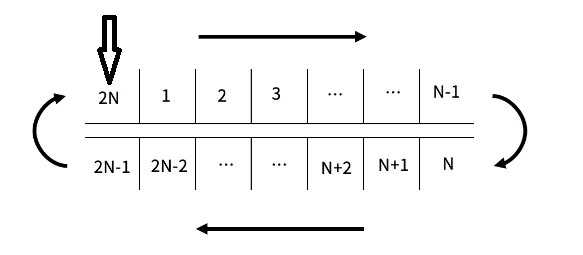

## 1-1-2. 로봇 이동
현재, 벨트 위의 로봇이 없으므로, 아무런 일도 일어나지 않는다.

## 1-1-3. 로봇 적재
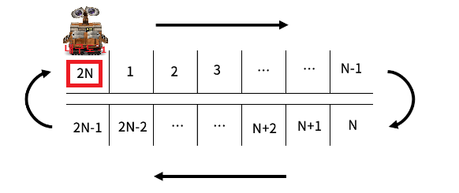

이런식으로 **내구도가 0인 칸의 개수가 K개 이상이 될 때까지** 반복한다.

# 2. 풀이 방법
풀이 방법은 2가지가 존재

1. 단순 구현
2. deque 자료구조를 사용한 구현
---
## 2-1. 단순 구현
단순 구현을 하는데는 많은 방법이 존재하겠지만, 나는 이렇게 했다. (바보 같을 수 있음 이해좀 ㅈㅅ)

### 전반적인 아이디어
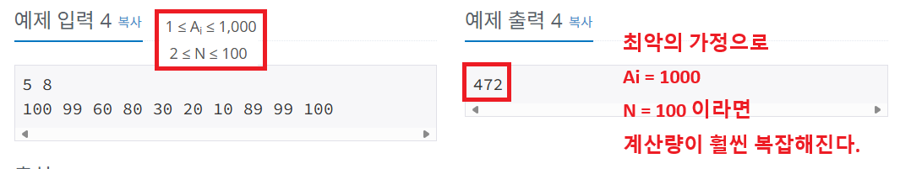
```
컨테이너의 회전을 배열의 회전으로 구현하기엔 계산량이 너무 많아진다.
컨테이너의 회전을 배열의 index로 간접적으로 접근하자!
```
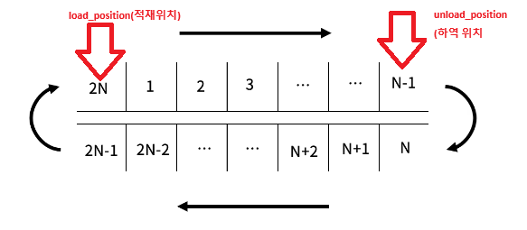
```
1단계
load_position(적재 위치) = 2N
unload_position(하역 위치) = N-1
```
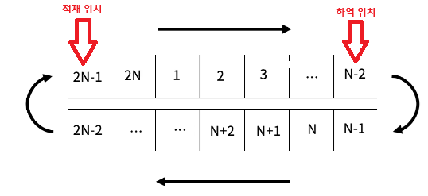
```
2단계
load_position(적재 위치) = 2N-1
unload_position(하역 위치) = N-2
```
---
### 기본 세팅
```cpp
// 로봇 적재 위치, 하역 위치 변수
int load_position, unload_position;

//conyeyor 라는 구조체 선언
//내구성과, 로봇의 유무를 담게 된다.
struct conveyor
{
    int durability;
    bool isRobot;
};

// conveyor 구조를 가지는 벡터 선언 (파이썬에서 list)
vector<conveyor> v;
```
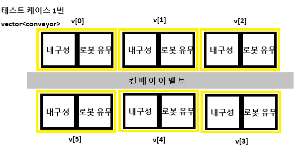
### 컨베이어 이동 함수
```cpp
void moveConveyor()
{
    for (int i = 0; i < (2 * N); i++)
    {
        //Unload Position
        if ((i + step) % (2 * N) == (N - 1))
            unload_position = i;

        //Load Position
        if ((i + step) % (2 * N) == 0)
            load_position = i;
    }
}
```
```
매 step(단계)마다, 회전된 컨베이어의 위치를 고려한
load_position 인덱스 값을 얻어온다.
unload_position 인덱스 값을 얻어온다.
```
---
### 로봇 적재 함수
```cpp
void loadRobot()
{
    //적재 위치의 내구도가 0이 아니라면
    if (v[load_position].durability > 0)
    {
        //로봇 적재
        v[load_position].isRobot = true;

        //내구도 -1
        v[load_position].durability -= 1;

        //내구도가 0이 된다면
        if (v[load_position].durability == 0)
            K--;
    }
}
```
```
1. 적재 위치에서의 내구도가 0인지 확인
2. 로봇 적재시, 내구도 -1
3. 내구도 0이 된다면 K값 카운트
```
---
### 로봇 하역 함수
```cpp
void unloadRobot()
{
    //하역 위치에 로봇이 존재한다면
    if (v[unload_position].isRobot)
        //로봇 하역
        v[unload_position].isRobot = false;
}
```
```
1. 하역 위치에 로봇이 존재하는지 확인
2. 존재한다면 로봇 하역
```
---
### 로봇 이동 함수
```cpp
void moveRobot()
{
    int idx_to, idx_from;

    for (int i = 1; i < N; i++)
    {
        idx_from = ((unload_position - i) % (2 * N) + (2 * N)) % (2 * N);
        idx_to = ((unload_position - i + 1) % (2 * N) + (2 * N)) % (2 * N);

        //움직일 로봇이 존재한다면
        if (v[idx_from].isRobot)
        {
            //이동하려는 위치에 로봇이 없으며, 내구성이 0이 아닐때
            if (!v[idx_to].isRobot && v[idx_to].durability > 0)
            {
                //로봇 1칸 이동
                v[idx_from].isRobot = false;
                v[idx_to].isRobot = true;

                //내구도 -1
                v[idx_to].durability -= 1;

                //내구도가 0이 된다면
                if (v[idx_to].durability == 0)
                    K--;
            }
        }
    }
}
```
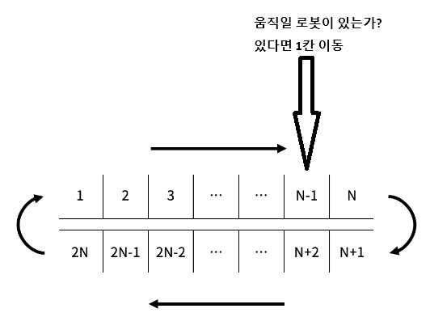
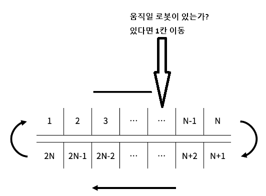
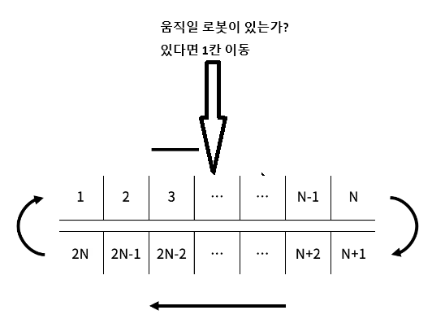

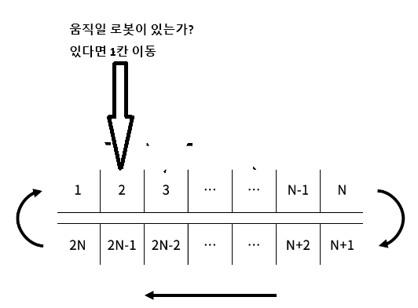
```
1. 이동할 로봇이 존재하는지 확인
2. 존재한다면 => 1. 이동하려는 위치에 로봇이 있는가? / 2. 이동하려는 위치에 내구성이 0인가?
3. 이동 가능하다면 내구도 -1
4. 내구도가 0이 된다면 K 카운트
```
---
### 최종 구조
```cpp
    // 내구도가 0인 칸의 개수가 K개가 될때까지
    while (K > 0)
    {    
        step++;

        moveConveyor();
        unloadRobot();

        moveRobot();
        unloadRobot();

        loadRobot();
    }

    cout << step << '\n';
    return 0;
```
```
컨베이어 회전 → 로봇 하역 → 로봇 이동 → 로봇 하역 → 로봇 적재 (반복)
```
## 2-2. deque 자료구조를 사용한 구현
주로 dijkstra, bfs 등에서 특별한 자료구조를 많이 사용한다.

이렇기에 단순한 구현 문제에서 <span style="color:red">**적합한 자료 구조를 사용할 생각을 잘 못하게 된다.**</span>

### deque 자료구조 이해
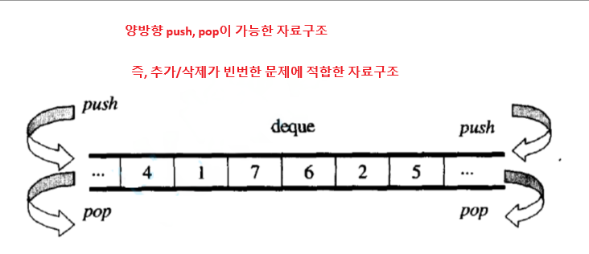
---
### deque_python
```python
from collections import deque

# deque 생성
d = deque()

# 원소 뒷방향으로 추가
d.append(2)
d.append(3)
d.append(4)

# 원소 앞방향으로 추가
d.appendleft(1)
d.appendleft(0)

# 현재 deque 출력
for item in d:
    print(item, end=' ')
print()

# 첫 번째 원소 제거
d.popleft()

# 마지막 원소 제거
d.pop()

# 현재 deque 출력
for item in d:
    print(item, end=' ')
print()

# 첫 번째, 마지막 값 확인
print("첫번째 값 확인 :", d[0])
print("마지막 값 확인 :", d[-1])

# 덱 비어있는지 여부 확인
if d:
    print("덱에는 원소가 남아있습니다.")
```
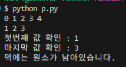
---
### deque_cpp
```cpp
#include <iostream>
#include <deque>

using namespace std;

deque<int> d;

int main()
{
	//원소 뒷방향으로 추가
	d.push_back(2);
	d.push_back(3);
	d.push_back(4);

	//원소 앞방향으로 추가
	d.push_front(1);
	d.push_front(0);

	for (int i = 0; i < d.size(); i++)
	{
		cout << d[i] << " ";
	}

	cout << endl;
	
	//첫 번째 원소 제거
	d.pop_front();

	//마지막 원소 제거
	d.pop_back();

	for (int i = 0; i < d.size(); i++)
	{
		cout << d[i] << " ";
	}

	cout << endl;

	cout << "첫번째 값 확인 : " <<d.front() << endl;
	cout << "마지막 값 확인 : " <<d.back() << endl;

	//덱 비어있는지 여부 확인
	if (!d.empty())
		cout << "덱에는 원소가 남아있습니다." << endl;

	return 0;
}
```
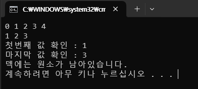
---
### python 구현 (김규민)
```python
# N 벨트
# 2N벨트가 감싸고있음
#로봇을 올리거나 이동 시, 내구도 1 감소
# 회전방향으로 한칸 이동
# 다음칸에 로봇이 없고, 내구도가 1 이상이여야 옮길 수 있음
# 0의 개수가 K 이상이면 끝
from collections import deque

def solve(N, K, Ai):
    belt = deque(Ai)
    robot = deque([False] * N) # N번째에서 로봇 내림
    cnt = 0

    while True:
        cnt += 1

        v_belt = belt.pop()
        belt.appendleft(v_belt)
        v_robot = robot.pop()
        robot.appendleft(v_robot)
        robot[-1] = False

        for i in range(N-2, -1, -1): # N번째 컨베이어 인덱스 N-1임. 내리는칸.
            #현재칸에 로봇이 있고, 다음칸에 로봇 없고, 내구도가 1 이상
            if robot[i] and not robot[i +1] and belt[i+1]>0:
                robot[i] = False #다음칸으로 로봇이가서 현재칸 빔
                robot[i+1] = True #로봇이 와서 차있음
                belt[i+1] -= 1 #내구도 감소
        robot[-1] = False #N번째 칸에서 로봇이 내림

        # 로봇 올리기
        if belt[0] >0:
            robot[0] = True
            belt[0] -= 1
        
        if belt.count(0) >= K:
            return cnt
    

N, K = map(int, input().split()) # N 컨베어 절반, K 내구도
Ai = list(map(int, input().split())) # 컨베이어 내구도
result = solve(N, K, Ai)
print(result)
```
---
### cpp 구현
```cpp
#define _CRT_SECURE_NO_WARNINGS
#include <iostream>
#include <deque>

using namespace std;

int N, K;
int step;
//내구성 정보 저장 dq
deque<int> d;
//로봇 정보 저장 dq
//크기 N, 초기값 false
deque<bool> r;

void input()
{
	freopen("input.txt", "r", stdin);
	cin >> N >> K;

	for (int i = 1; i <= 2 * N; i++)
	{
		int dur;
		cin >> dur;
		d.push_back(dur);
	}
}

int main()
{
	input();
	r.resize(N);

	while (1)
	{
		//단계 증가
		step++;
		
		//1. 벨트 회전
		//deque 자료구조 덕분에 간단해졌다.
		d.push_front(d.back());
		d.pop_back();

		//벨트가 회전해서 적재 위치에는 로봇이 없음을 의미
		r.push_front(false);
		//로봇 하역
		r[N - 1] = false;

		//2. 로봇 이동
		for (int i = N - 1; i >= 0; i--)
		{
			if (r[i] && !r[i + 1] && d[i + 1] > 0)
			{
				//로봇 이동
				r[i] = false;
				r[i + 1] = true;
				//내구도 -1
				d[i + 1]--;
			}
		}

		//로봇 하역
		r[N - 1] = false;

		//3. 로봇 적재
		if (!r[0] && d[0] > 0)
		{
			r[0] = true;
			d[0]--;
		}

		int cnt = 0;
		for (int i = 0; i < d.size(); i++)
		{
			if (d[i] == 0)
				cnt++;
		}

		if (cnt >= K)
			break;
	}

	cout << step << '\n';
	return 0;
}
```
---