# 1. 문제 상황 이해
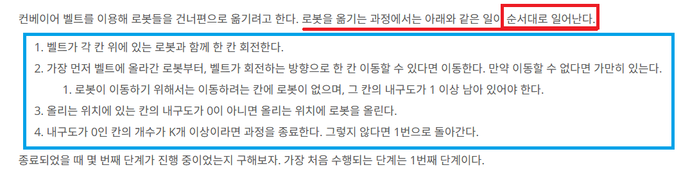

"순서대로" 일어난다

1번째 단계에 대해서 착각하기 쉽다.

## 1-1-0. 초기상태
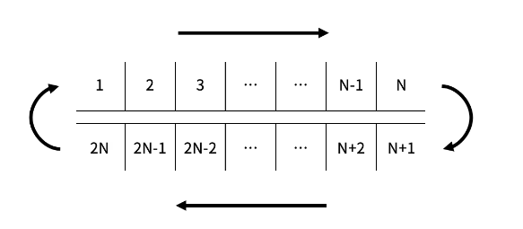

## 1-1-1. 벨트 이동
현재는, 제일 처음의 상태이므로 벨트 위에 로봇이 없는 상태로 한 칸 회전하게 된다.
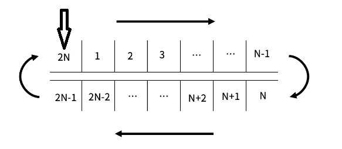

## 1-1-2. 로봇 이동
현재, 벨트 위의 로봇이 없으므로, 아무런 일도 일어나지 않는다.

## 1-1-3. 로봇 적재
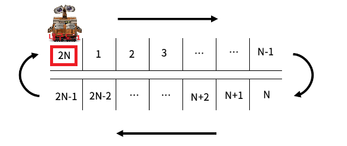

이런식으로 **내구도가 0인 칸의 개수가 K개 이상이 될 때까지** 반복한다.

# 2. 풀이 방법
풀이 방법은 2가지가 존재

1. 단순 구현
2. deque 자료구조를 사용한 구현
---
## 2-1. 단순 구현
단순 구현을 하는데는 많은 방법이 존재하겠지만, 나는 이렇게 했다. (바보 같을 수 있음 이해좀 ㅈㅅ)

### 전반적인 아이디어
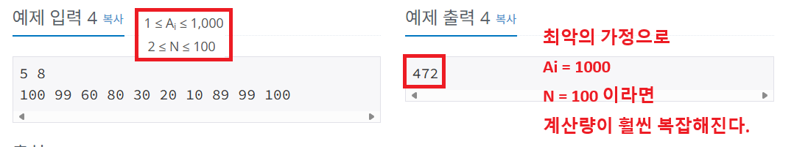
```
컨테이너의 회전을 배열의 회전으로 구현하기엔 계산량이 너무 많아진다.
컨테이너의 회전을 배열의 index로 간접적으로 접근하자!
```
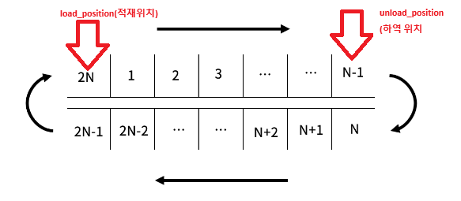
```
1단계
load_position(적재 위치) = 2N
unload_position(하역 위치) = N-1
```
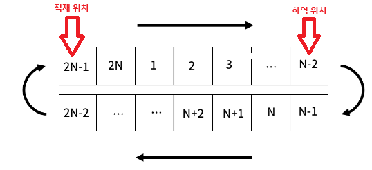
```
2단계
load_position(적재 위치) = 2N-1
unload_position(하역 위치) = N-2
```
---
### 기본 세팅
```cpp
// 로봇 적재 위치, 하역 위치 변수
int load_position, unload_position;

//conyeyor 라는 구조체 선언
//내구성과, 로봇의 유무를 담게 된다.
struct conveyor
{
    int durability;
    bool isRobot;
};

// conveyor 구조를 가지는 벡터 선언 (파이썬에서 list)
vector<conveyor> v;
```

### 컨베이어 이동 함수
```cpp
void moveConveyor()
{
    for (int i = 0; i < (2 * N); i++)
    {
        //Unload Position
        if ((i + step) % (2 * N) == (N - 1))
            unload_position = i;

        //Load Position
        if ((i + step) % (2 * N) == 0)
            load_position = i;
    }
}
```
```
매 step(단계)마다, 회전된 컨베이어의 위치를 고려한
load_position 인덱스 값을 얻어온다.
unload_position 인덱스 값을 얻어온다.
```
---
### 로봇 적재 함수
```cpp
void loadRobot()
{
    //적재 위치의 내구도가 0이 아니라면
    if (v[load_position].durability > 0)
    {
        //로봇 적재
        v[load_position].isRobot = true;

        //내구도 -1
        v[load_position].durability -= 1;

        //내구도가 0이 된다면
        if (v[load_position].durability == 0)
            K--;
    }
}
```
```
1. 적재 위치에서의 내구도가 0인지 확인
2. 로봇 적재시, 내구도 -1
3. 내구도 0이 된다면 K값 카운트
```
---
### 로봇 하역 함수
```cpp
void unloadRobot()
{
    //하역 위치에 로봇이 존재한다면
    if (v[unload_position].isRobot)
        //로봇 하역
        v[unload_position].isRobot = false;
}
```
```
1. 하역 위치에 로봇이 존재하는지 확인
2. 존재한다면 로봇 하역
```
---
### 로봇 이동 함수
```cpp
void moveRobot()
{
    int idx_to, idx_from;

    for (int i = 1; i < N; i++)
    {
        idx_from = ((unload_position - i) % (2 * N) + (2 * N)) % (2 * N);
        idx_to = ((unload_position - i + 1) % (2 * N) + (2 * N)) % (2 * N);

        //움직일 로봇이 존재한다면
        if (v[idx_from].isRobot)
        {
            //이동하려는 위치에 로봇이 없으며, 내구성이 0이 아닐때
            if (!v[idx_to].isRobot && v[idx_to].durability > 0)
            {
                //로봇 1칸 이동
                v[idx_from].isRobot = false;
                v[idx_to].isRobot = true;

                //내구도 -1
                v[idx_to].durability -= 1;

                //내구도가 0이 된다면
                if (v[idx_to].durability == 0)
                    K--;
            }
        }
    }
}
```
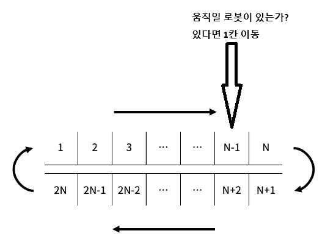
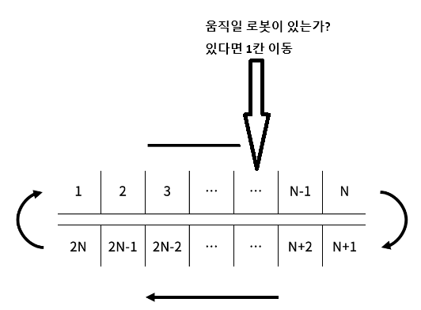
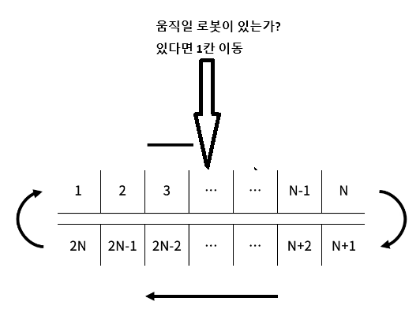
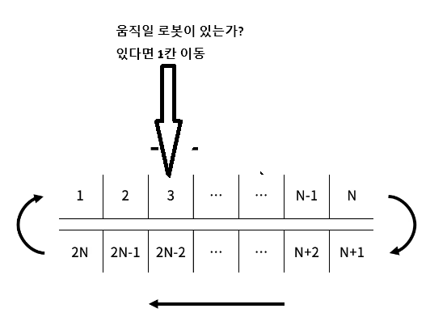
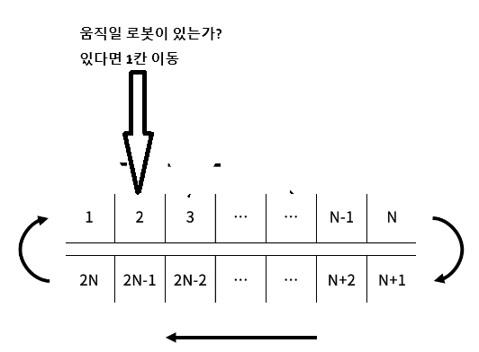
```
1. 이동할 로봇이 존재하는지 확인
2. 존재한다면 => 1. 이동하려는 위치에 로봇이 있는가? / 2. 이동하려는 위치에 내구성이 0인가?
3. 이동 가능하다면 내구도 -1
4. 내구도가 0이 된다면 K 카운트
```
---
### 최종 구조
```cpp
    // 내구도가 0인 칸의 개수가 K개가 될때까지
    while (K > 0)
    {    
        step++;

        moveConveyor();
        unloadRobot();

        moveRobot();
        unloadRobot();

        loadRobot();
    }

    cout << step << '\n';
    return 0;
```
```
컨베이어 회전 → 로봇 하역 → 로봇 이동 → 로봇 하역 → 로봇 적재 (반복)
```
## 2-2. deque 자료구조를 사용한 구현